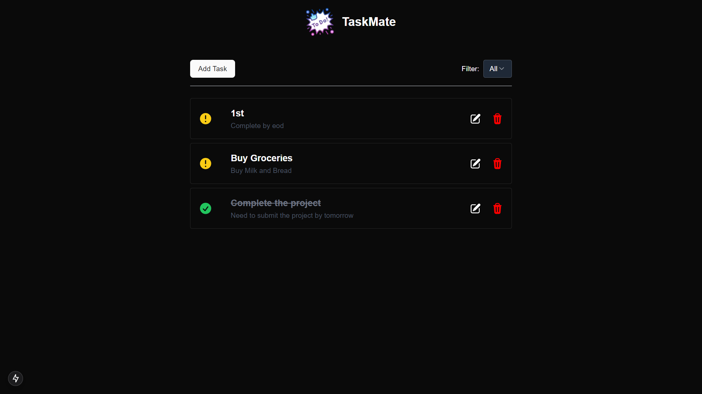
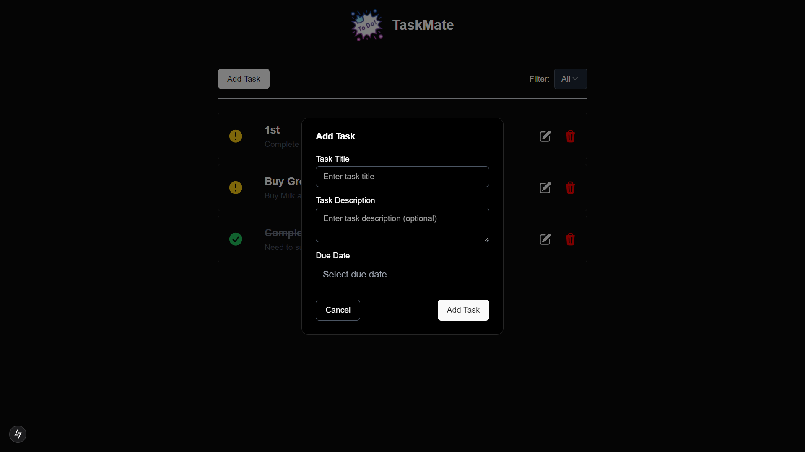
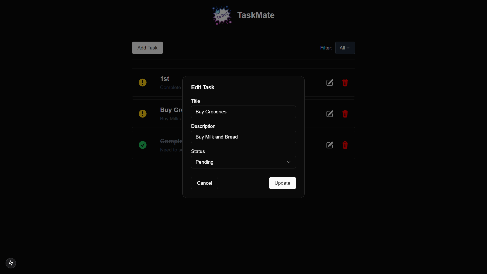
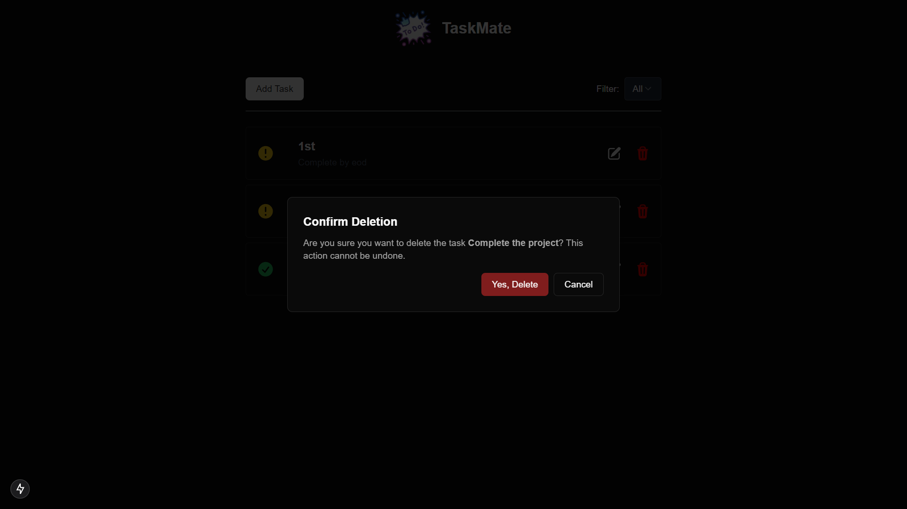
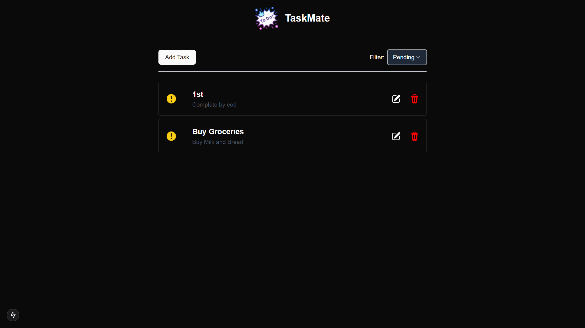
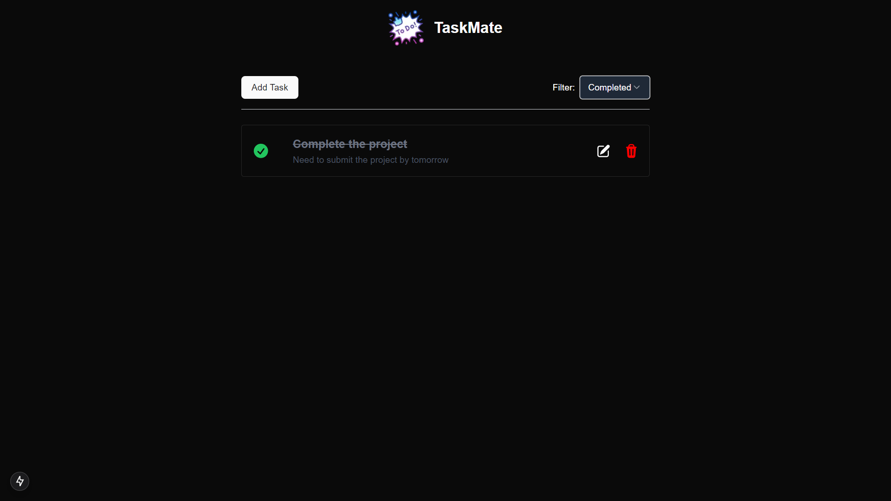

# **To-Do Application**

  
_A modern and sleek task management application built with Next.js, Hasura, and ShadCN components._

---

## **Overview**

This is a responsive to-do application designed to help users efficiently manage their tasks. Built with a modern tech stack, it offers the following features:

- Add tasks with a title, description, and due date.
- Filter tasks by their status (All, Pending, Completed).
- Aesthetic dark mode design for a smooth user experience.

---

## **Screenshots**

### **Add Task Modal**

### **Edit Task Modal**

### **Delete Task Modal**

### **Task List with Pending Filters**

### **Task List with Completed Filters**

## 

<!--
## **Tech Stack**

### **Frontend**

- [Next.js](https://nextjs.org/)
- [ShadCN UI](https://shadcn.dev/)
- [Tailwind CSS](https://tailwindcss.com/)

### **Backend**

- [Hasura GraphQL](https://hasura.io/)

---
-->
